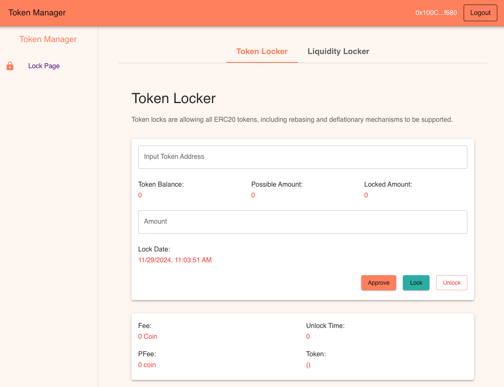
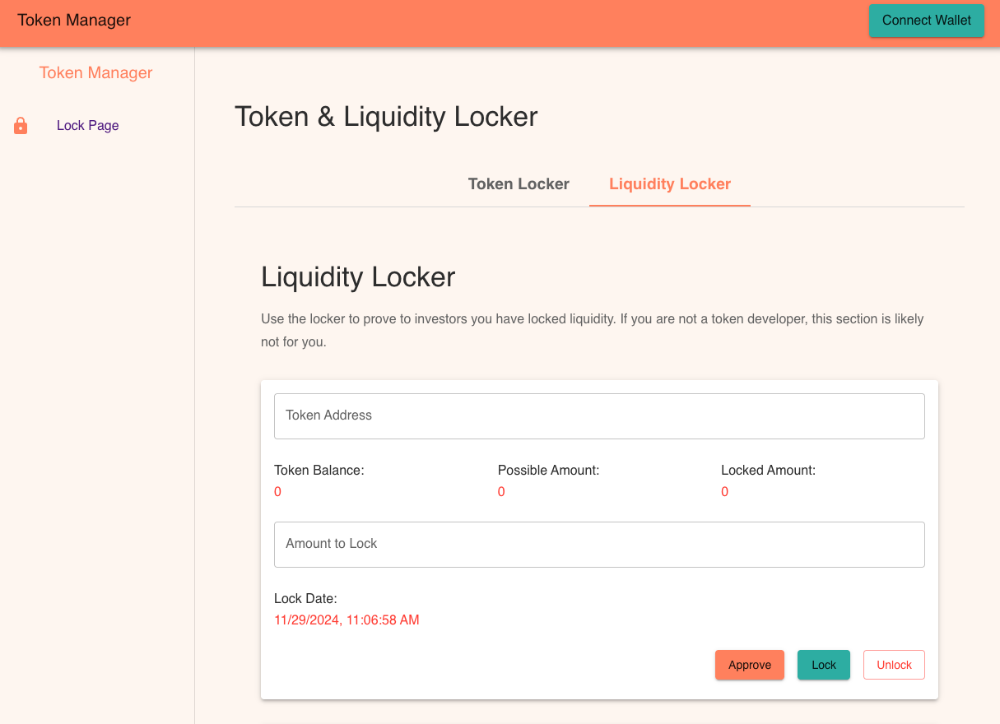

# React App with Token Locker & Liquidity Locker

This project connect is demo app with web3 login by MetaMask function, using Material UI
This project is built from scratch using npx create-react-app.
Technology: React, React Material UI, web3-react.
To test app, clone and run npm install, then run npm start to check the UI.
This UI responsive with mobile.

Website deployed here, you can have a look: https://react-mui.onrender.com

Please check the UI as below:

